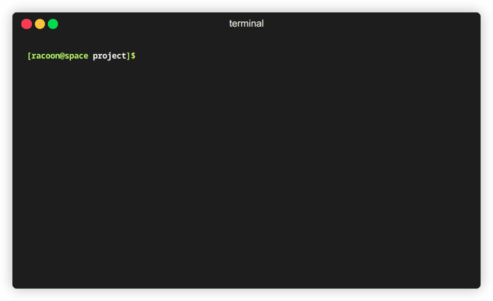

<p align="center">
  
</p>

`canny` creates a clickable pane, based on the standard input.

or more precise:  
  
`canny` reads lines from STDIN, allowing you to interactively select a value, which is then returned to STDOUT.



* canny enables interactive filters in piped commands
* a unix-philosophy experiement
* brings the mouse to the cli :)
* a [fzf-inspired](https://github.com/junegunn/fzf) tool

**But, what does it do?**  
- Every non-white space becomes a token
- Every token will be possible element for selection
- After a selection, the token will be returned through standard output

## Usage
Here are some examples, after the [installation step](#installation)  

This will open the selected file/directory of the current directory in vim:
```sh
vim $(ls -C | canny)
```

Another possible usage is this:
```sh
ls -C | canny | xargs xdg-open
```
This opens the selected file with it's standard application.

For more ways to use `canny` check out the `examples` directory.  

### Html Parser
- when run with the `--tags` flag, canny will look for HTML tags (excluding semantics) and makes tag bodies clickable.
- this function allows for a predefinition of clickable elements, in contrast to the default case, where every non-whitespace character is clickable
- if the tags are nested, only the highest level of tags is clickable
- in the case ther are no tags in the text, every word will be tokenized and clickable.

(( insert html example here ))
Here is an example input (from the examples directory):


## Installation
> [!Note]
> only tested / written for linux

You can install `canny` from the PyPI repositories using the following command:
```
pip install canny
```
or check the realease page for a manual installation.

on ubuntu first install ncurses-term:
```
apt install ncurses-term
```


## Issues

> [!Important]
> This tool currently supports python3.10 and upwards

On version with a python version lower than 3.10 the `curses.BUTTON5` constant is not supported.

Please report possible issues [here](https://github.com/Pieli/canny/issues). 

## License

This project is licensed under the [GPLv3 License](LICENSE).

~ 🦝

